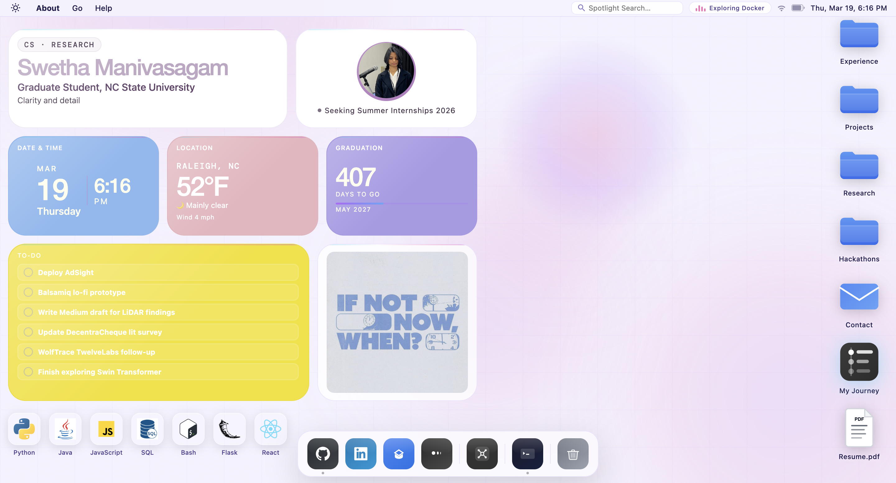

# Swetha Manivasagam – Portfolio

Welcome to my personal portfolio website! 

This repository contains the source code for my portfolio hosted using GitHub Pages.

I tried to show you what my everyday Macbook desktop screen looks like!

<p align="center">
  
</p>

Find it at: https://SwethaatGH.github.io

---

## About Me

I'm **Swetha Manivasagam**, a Computer Science graduate student at NC State University. 

I enjoy working with data and the process of making sense of complex problems. I value clarity and detail. I am open to engaging in technically ambitious engineering work.

---

## Tech Stack Involved

**Frontend**
- HTML5, CSS3, JavaScript

**Tools & Libraries**
- Git & GitHub
- Web3Forms (Contact API)
- Font Awesome

---

## Project Directory Structure

```bash
portfolio/
│── index.html
│── css/
│   └── style.css
│── js/
│   └── main.js
│── assets/
│   ├── icons/
│   ├── resume
│   └── profile_picture
```

---

## Contact

Feel free to reach out!

- Email: smaniva4@ncsu.edu  
- LinkedIn: https://linkedin.com/in/swetha-manivasagam  
- Portfolio: https://SwethaatGH.github.io (contact form) 

View and download my resume in the website.

Try out the terminal!

---

## Notes

- This project is continuously updated with new features and improvements

---
